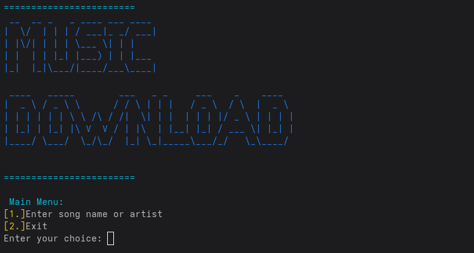

# 🎶 Music Download Tool

A simple cross-platform terminal app to search and download music from YouTube — works on Linux, Windows, and Termux (Android).



---

## 📘 Table of Contents

* [Installation](#installation)
* [Usage](#usage)
* [Project Structure](#project-structure)
* [Credits](#credits)

---

## ⚙️ Installation

### 💻 Windows

```bash
python -m venv venv
venv\Scripts\activate
pip install yt-dlp colorama
```

### 🐧 Linux

```bash
python3 -m venv venv
source venv/bin/activate
pip install yt-dlp colorama
```

### 📱 Termux (Android)

```bash
termux-setup-storage
python -m venv venv
source venv/bin/activate
pip install yt-dlp colorama
```

### 🧰 Manual Git Installation

```bash
git clone https://github.com/BenCrookedTech/music-download.git
cd music-download
python -m venv venv
source venv/bin/activate
pip install -r requirements.txt
```

---

## 🚀 Usage

1. Run the app:

   ```bash
   python main.py
   ```

2. Choose an option:

   ```
   [1] Enter song name or artist
   [2] Exit
   ```

3. Enter a song/artist name and select a number to download.

### 🎯 Output Example:

```
🎧 Enter artist or song name: j cole
1. J. Cole - No Role Models
2. J. Cole - Fire Squad
...
✅ Download complete.
```

---

## 📁 Project Structure

```
music-download/
├── index.html          # One-page documentation
├── banner.py           # Banner art + styling
├── paths.py            # Detects Downloads folder
├── downloader.py       # Main logic
├── assets/
│   └── tool.png        # Screenshot
├── style.css           # CSS styling
└── requirements.txt    # Required dependencies
```

---

## 🙌 Credits

* Developed by **BenCrookedTech**
* Built with:

  * `yt-dlp` – media downloading
  * `colorama` – colored prompts
  * `Python 3` – scripting

📎 [Join my Telegram Channel](https://t.me/de3athas)
📜 *For educational purposes only.*
